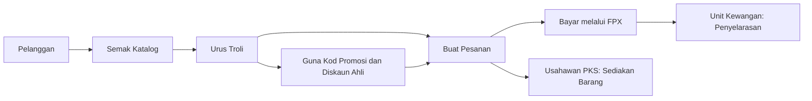
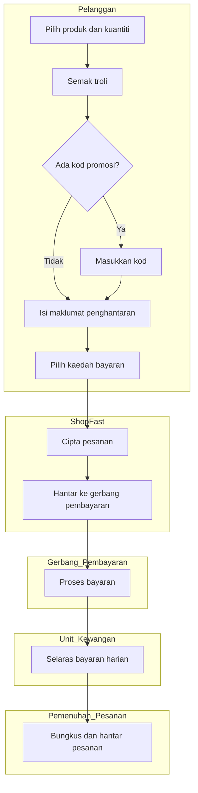

# D02 Spesifikasi Keperluan Bisnes (BRS): ShopFast

> Sistem fiktif untuk latihan SQA. Semua nama, agensi, emel dan data adalah rekaan.
> Struktur dokumen mengikut templat rasmi [D02 Dokumen Spesifikasi Keperluan Bisnes (BRS)](../../../references/templates-D01-D18/docx/D02_DOKUMEN_SPESIFIKASI_KEPERLUAN_BISNES_BRS.docx).

| Perkara | Butiran |
|---|---|
| Nama Sistem | ShopFast (Sistem Jualan Dalam Talian Produk PKS Tempatan) |
| Agensi Pemilik | Perbadanan Usahawan Digital (fiktif) |
| No. Dokumen | PUD-SF-D02 |
| Versi | 1.0 |
| Tarikh | 1 September 2026 |
| Status | Untuk semakan |

## Kawalan Dokumen (Document Control)

| Versi | Tarikh | Disediakan oleh | Ringkasan Perubahan |
|---|---|---|---|
| 0.9 | 18 Ogos 2026 | Pasukan Analisis Bisnes | Draf awal selepas bengkel keperluan |
| 1.0 | 1 September 2026 | Pasukan Analisis Bisnes | Kemas kini selepas maklum balas pemilik proses |

---

## 1. PENGENALAN

### 1.1 Tujuan Bisnes

Perbadanan Usahawan Digital (fiktif) ialah agensi yang membantu Perusahaan Kecil dan Sederhana (PKS) tempatan memasarkan produk secara dalam talian. Pada masa ini usahawan menjual melalui media sosial dan pesanan manual melalui aplikasi mesej. Kaedah ini menyebabkan pesanan tercicir, pengiraan harga yang tidak konsisten dan tiada rekod jualan yang boleh dianalisis.

ShopFast dibangunkan sebagai platform jualan dalam talian (e-commerce) yang membolehkan orang awam membeli produk PKS tempatan, menggunakan kod promosi kempen agensi dan membayar melalui kaedah pembayaran tempatan. Sistem ini menyumbang kepada sasaran agensi untuk meningkatkan pendapatan dalam talian usahawan bimbingan.

### 1.2 Skop Bisnes

Dalam skop:
1. Paparan katalog produk PKS tempatan beserta harga dan stok.
2. Pengurusan troli beli-belah (shopping cart).
3. Kod promosi kempen agensi dan diskaun ahli (member).
4. Pembuatan pesanan (checkout) dan pembayaran dalam talian.
5. Log masuk pelanggan, semakan pesanan dan penjejakan status pesanan.
6. Pemantauan operasi sistem.

Luar skop fasa ini:
1. Pengurusan inventori dan penambahan produk oleh usahawan (dibuat secara manual oleh agensi).
2. Penghantaran fizikal dan integrasi syarikat kurier.
3. Pemulangan barang dan bayaran balik (refund).

### 1.3 Gambaran Keseluruhan Projek

Projek dilaksanakan secara dalaman (in-house) oleh Bahagian Transformasi Digital agensi dalam tempoh 6 bulan. Pelanggan mengakses ShopFast melalui pelayar web. Pembayaran diproses oleh gerbang pembayaran FPX (Financial Process Exchange) melalui penyedia perkhidmatan pembayaran berlesen, dan notifikasi dihantar melalui perkhidmatan emel agensi.

### 1.4 Senarai Pemegang Taruh (Stakeholders)

| Pemegang Taruh | Peranan | Kepentingan |
|---|---|---|
| Ketua Pegawai Eksekutif agensi | Pemilik Projek | Pencapaian sasaran jualan usahawan |
| Bahagian Pembangunan Usahawan | Pemilik Proses | Kempen promosi dan senarai produk |
| Bahagian Transformasi Digital | Pasukan Projek | Pembangunan dan operasi sistem |
| Unit Kewangan | Pemilik Proses | Penyelarasan (reconciliation) bayaran FPX |
| Pegawai Keselamatan ICT (ICTSO) | Penasihat | Keselamatan dan perlindungan data peribadi |
| Pelanggan (orang awam) | Pengguna Akhir | Pembelian yang mudah dan selamat |
| Usahawan PKS | Pembekal Produk | Jualan dan maklumat pesanan |

---

## 2. KEPERLUAN PENGURUSAN BISNES

### 2.1 Matlamat dan Objektif

Matlamat: Menyediakan saluran jualan dalam talian yang dipercayai untuk produk PKS tempatan.

Objektif:
1. Meningkatkan jualan dalam talian usahawan bimbingan sebanyak 30% dalam tempoh 12 bulan selepas pelancaran.
2. Mengurangkan pesanan manual yang tercicir kepada sifar melalui pesanan berdigit yang direkodkan.
3. Menyokong kempen promosi agensi (contoh: jualan musim perayaan) melalui kod promosi dan diskaun ahli.
4. Melindungi data peribadi pelanggan selaras dengan Akta Perlindungan Data Peribadi 2010 (Akta 709).

### 2.2 Arkitektur Bisnes



### 2.3 Arkitektur Maklumat

| Entiti Maklumat | Keterangan | Pemilik Data |
|---|---|---|
| Produk | Maklumat produk PKS: kod, nama, harga, stok | Bahagian Pembangunan Usahawan |
| Troli | Senarai item yang dipilih oleh pelanggan sebelum pesanan | Sistem (sementara) |
| Kod Promosi | Kod kempen, kadar diskaun dan tempoh sah | Bahagian Pembangunan Usahawan |
| Pesanan | Rekod pembelian, jumlah bayaran dan status pesanan | Unit Kewangan |
| Pelanggan | Nama, emel, nombor telefon, poskod penghantaran, status keahlian | Bahagian Transformasi Digital |

---

## 3. KEPERLUAN PENGOPERASIAN BISNES

### 3.1 Keperluan Fungsi Bisnes

#### 3.1.1 Penggunaan Notasi

Model Fungsi Bisnes menggunakan Rajah Hierarki Fungsi (Functional Hierarchy Diagram) dalam bentuk senarai bernombor: Sistem, Modul dan Fungsi.

#### 3.1.2 Model Fungsi Bisnes

```
ShopFast
  1. Katalog
     1.1 Papar senarai produk
  2. Troli
     2.1 Tambah produk
     2.2 Buang produk
     2.3 Guna kod promosi
  3. Pesanan
     3.1 Buat pesanan (checkout)
     3.2 Bayar pesanan
     3.3 Semak pesanan
     3.4 Kemas kini status pesanan
  4. Akaun
     4.1 Log masuk
  5. Operasi
     5.1 Pemantauan kesihatan sistem
```

#### 3.1.3 Senarai Pengguna

| Pengguna | Keterangan |
|---|---|
| Pelanggan | Orang awam yang membeli produk melalui ShopFast |
| Pegawai Operasi | Pegawai agensi yang memantau ketersediaan sistem |
| Pegawai Kewangan | Pegawai yang menyelaras bayaran pesanan dengan penyata FPX |
| Pegawai Pemenuhan Pesanan | Pegawai yang membungkus dan menghantar pesanan |

#### 3.1.4 Senarai Keperluan Bisnes (Business Requirements)

| ID | Keperluan Bisnes | Pemilik Proses | Keutamaan |
|---|---|---|---|
| BR-01 | Pelanggan boleh melihat katalog produk PKS tempatan beserta harga dan status stok terkini. | Bahagian Pembangunan Usahawan | Tinggi |
| BR-02 | Pelanggan boleh memilih produk dan kuantiti ke dalam troli serta melihat jumlah harga sebelum membuat pesanan. | Bahagian Pembangunan Usahawan | Tinggi |
| BR-03 | Agensi boleh menawarkan kod promosi kempen dengan tempoh sah, dan ahli berdaftar program usahawan (member) menerima diskaun ahli, tertakluk kepada had jumlah diskaun yang ditetapkan oleh Unit Kewangan. | Bahagian Pembangunan Usahawan | Tinggi |
| BR-04 | Caj penghantaran standard dikenakan bagi setiap pesanan, dan penghantaran percuma diberikan bagi pesanan melebihi RM200. | Bahagian Pembangunan Usahawan | Sederhana |
| BR-05 | Pelanggan boleh membuat pesanan dengan maklumat penghantaran yang sah dan membayar melalui FPX, kad atau e-dompet (e-wallet). | Unit Kewangan | Tinggi |
| BR-06 | Status setiap pesanan boleh dijejak daripada pembayaran hingga barang diterima, dan pesanan boleh dibatalkan sebelum barang dihantar. | Unit Kewangan | Tinggi |
| BR-07 | Akaun dan data pelanggan dilindungi: log masuk menggunakan emel dan kata laluan, akaun dikunci sementara selepas beberapa cubaan log masuk gagal, dan maklumat pesanan hanya boleh dilihat oleh pelanggan yang membuatnya, selaras dengan Akta 709. | ICTSO | Tinggi |
| BR-08 | Sistem sentiasa tersedia dan kekal responsif sepanjang tempoh kempen jualan, termasuk jualan musim perayaan. | Bahagian Transformasi Digital | Tinggi |

### 3.2 Keperluan Proses Bisnes

#### 3.2.1 Penggunaan Notasi

Model Proses Bisnes menggunakan Rajah Aliran Proses (Process Flow Diagram, PFD) dengan swimlane mengikut peranan.

#### 3.2.2 Model Proses Bisnes

PFD-SF-01 Proses Pembelian Dalam Talian:



Definisi Fungsi Bisnes ringkas:

| Aktiviti | Input | Output | Nota Pemilik Proses |
|---|---|---|---|
| Pilih produk dan kuantiti | Kod produk, kuantiti | Item troli | Had kuantiti setiap produk untuk elak borong |
| Masukkan kod | Kod promosi | Diskaun promosi | Satu kod sahaja bagi setiap pesanan; ahli juga menerima diskaun ahli |
| Isi maklumat penghantaran | Nama, emel, telefon, poskod | Maklumat pesanan | Nombor telefon mudah alih Malaysia sahaja |
| Cipta pesanan | Troli dan maklumat pelanggan | Nombor pesanan | Nombor pesanan mudah dirujuk oleh khidmat pelanggan |
| Bungkus dan hantar pesanan | Pesanan berbayar | Status pesanan dikemas kini | Pesanan yang sudah dihantar tidak boleh dibatalkan |

### 3.3 Pengiraan Saiz Sistem Aplikasi

Pengiraan saiz terperinci menggunakan Function Points Analysis (FPA) dibuat dalam D03 SRS, seksyen 7.

---

## 4. LAMPIRAN

1. Minit Bengkel Keperluan ShopFast, 12 Ogos 2026 (fiktif).
2. Senarai kod promosi kempen 2026 (fiktif).
3. Kontrak API: [openapi.yaml](openapi.yaml).
