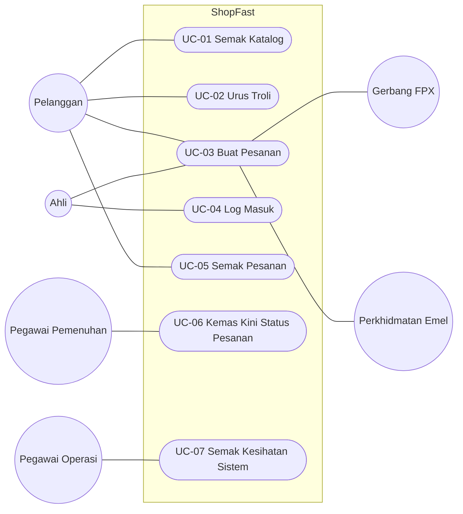
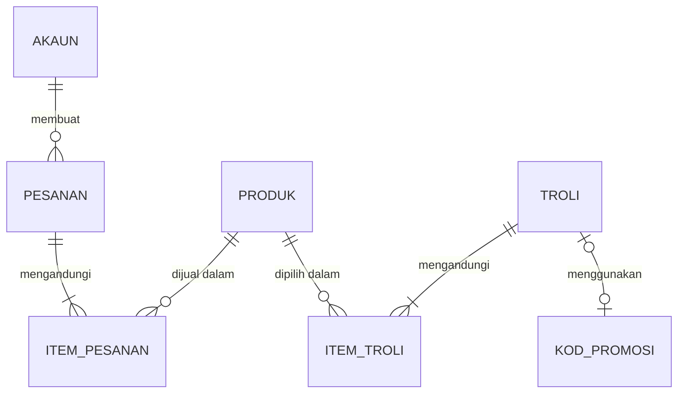
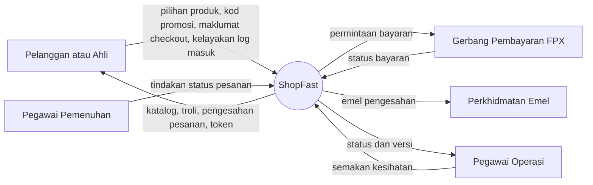
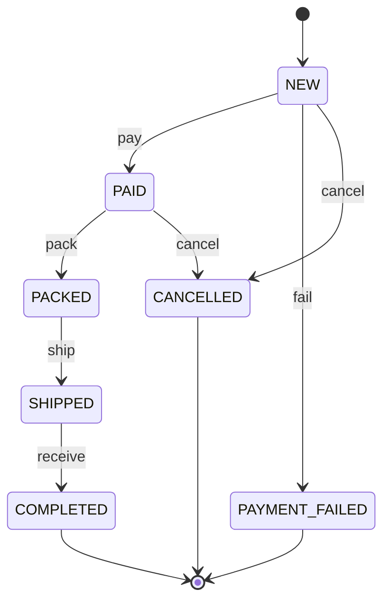

# D03 Spesifikasi Keperluan Sistem (SRS): ShopFast

> Sistem fiktif untuk latihan SQA. Semua nama, agensi, emel dan data adalah rekaan.
> Struktur dokumen mengikut templat rasmi [D03 Dokumen Spesifikasi Keperluan Sistem (SRS)](../../../references/templates-D01-D18/docx/D03_DOKUMEN_SPESIFIKASI_KEPERLUAN_SISTEM_SRS.docx).
> Dokumen berkaitan: [BRS-ShopFast.md](BRS-ShopFast.md), [architecture.md](architecture.md), [openapi.yaml](openapi.yaml).

| Perkara | Butiran |
|---|---|
| Nama Sistem | ShopFast (Sistem Jualan Dalam Talian Produk PKS Tempatan) |
| Agensi Pemilik | Perbadanan Usahawan Digital (fiktif) |
| No. Dokumen | PUD-SF-D03 |
| Versi | 1.1 |
| Tarikh | 5 September 2026 |
| Status | Untuk semakan |

## Kawalan Dokumen (Document Control)

| Versi | Tarikh | Disediakan oleh | Ringkasan Perubahan |
|---|---|---|---|
| 1.0 | 25 Ogos 2026 | Pasukan Analisis Sistem | Draf awal daripada BRS versi 0.9 |
| 1.1 | 5 September 2026 | Pasukan Analisis Sistem | Tambah keperluan checkout REQ-CHK, diskaun ahli, kitar hayat pesanan dan senario use case |

---

## 1. PENGENALAN

### 1.1 Tujuan Sistem

ShopFast membolehkan pelanggan membeli produk PKS tempatan secara dalam talian, menggunakan kod promosi kempen agensi, menerima diskaun ahli (member) dan membayar melalui FPX, kad atau e-dompet. Sistem ini menyokong objektif bisnes dalam BRS seksyen 2.1 iaitu meningkatkan jualan dalam talian usahawan dan merekodkan setiap pesanan secara digital.

### 1.2 Skop Sistem

Sistem terdiri daripada:
1. Aplikasi web satu halaman (Single Page Application, SPA) untuk pelanggan.
2. API ShopFast (Node.js) yang mengandungi logik troli, diskaun, pesanan, kitar hayat pesanan dan log masuk.
3. Integrasi dengan gerbang pembayaran FPX (mock untuk persekitaran latihan) dan perkhidmatan emel.

Kontrak antara muka API ditakrifkan dalam [openapi.yaml](openapi.yaml).

### 1.3 Senarai Aktor Sistem

| Aktor | Jenis | Keterangan Fungsi |
|---|---|---|
| Pelanggan | Manusia | Menyemak katalog, mengurus troli, membuat pesanan dan menyemak pesanan |
| Ahli (Member) | Manusia | Pelanggan yang log masuk dengan akaun keahlian dan layak menerima diskaun ahli |
| Pegawai Pemenuhan Pesanan | Manusia | Mengemas kini status pesanan semasa pembungkusan dan penghantaran |
| Pegawai Operasi | Manusia | Memantau status kesihatan sistem |
| Gerbang Pembayaran FPX | Sistem luaran | Memproses bayaran pesanan |
| Perkhidmatan Emel | Sistem luaran | Menghantar emel kepada pelanggan |

### 1.4 Istilah (Glossary)

| Istilah | Maksud |
|---|---|
| PKS | Perusahaan Kecil dan Sederhana |
| Pelanggan | Orang awam yang menggunakan ShopFast untuk membeli produk |
| Ahli (Member) | Pelanggan yang akaunnya mempunyai status keahlian (`isMember` bernilai true) |
| Sesi troli | Troli yang dikenal pasti melalui pengepala (header) `X-Session-Id` yang dijana oleh pelayar |
| Token | Bearer token yang dipulangkan selepas log masuk berjaya dan dihantar dalam pengepala `Authorization` |
| Subtotal | Jumlah harga item dalam troli sebelum diskaun dan caj penghantaran |
| Diskaun ahli | Diskaun yang diberikan kepada ahli yang log masuk |
| Diskaun promosi | Diskaun daripada kod promosi kempen |
| FPX | Financial Process Exchange, kaedah pembayaran perbankan dalam talian |
| p95 | Persentil ke-95 masa respons: 95% permintaan selesai dalam tempoh ini atau lebih cepat |

---

## 2. PEMODELAN FUNGSI SISTEM

### 2.1 Penggunaan Notasi

Rajah Hierarki Fungsian Sistem ditunjukkan sebagai senarai bernombor bertingkat: Sistem, Subsistem, Modul dan Fungsi.

### 2.2 Rajah Hierarki Fungsian Sistem

```
ShopFast
  1. Subsistem Jualan
     1.1 Modul Katalog: Papar produk
     1.2 Modul Troli: Tambah item, Buang item, Guna kod promosi
     1.3 Modul Checkout: Kira jumlah, Sahkan maklumat, Buat pesanan, Bayar
     1.4 Modul Pesanan: Papar pesanan, Kemas kini status pesanan
  2. Subsistem Akaun
     2.1 Modul Log Masuk: Log masuk, Penguncian akaun
  3. Subsistem Operasi
     3.1 Modul Pemantauan: Semakan kesihatan, Log permintaan
```

### 2.3 Jadual Pemadanan Aktor Dengan Fungsi Sistem

| Fungsi Sistem | Pelanggan | Ahli | Pegawai Pemenuhan | Pegawai Operasi | Gerbang FPX | Perkhidmatan Emel |
|---|---|---|---|---|---|---|
| Papar produk | X | X | | | | |
| Tambah dan buang item | X | X | | | | |
| Guna kod promosi | X | X | | | | |
| Buat pesanan | X | X | | | | X |
| Bayar | X | X | | | X | |
| Papar pesanan | X | X | | | | |
| Kemas kini status pesanan | X | X | X | | X | |
| Log masuk | X | X | | | | |
| Semakan kesihatan | | | | X | | |

### 2.4 Keperluan Checkout (REQ-CHK)

| ID | Keperluan | BR | Kriteria Penerimaan (Acceptance Criteria) |
|---|---|---|---|
| REQ-CHK-01 | Kuantiti bagi setiap item dalam troli hendaklah nombor bulat antara 1 hingga 10 (termasuk 1 dan 10). Kuantiti 0, lebih daripada 10 atau bukan nombor bulat ditolak dengan 400 `VALIDATION_ERROR`. Produk yang baki stoknya 0 ditolak dengan 400 `OUT_OF_STOCK`. | BR-02 | Kuantiti dalam julat 1 hingga 10 diterima (201). Kuantiti di luar julat dan nilai bukan nombor bulat ditolak (400 `VALIDATION_ERROR`). Menambah P006 memulangkan 400 `OUT_OF_STOCK`. |
| REQ-CHK-02 | Kod promosi hendaklah 6 hingga 10 aksara yang terdiri daripada huruf besar dan digit sahaja; selain itu ditolak dengan 422 `INVALID_CODE_FORMAT`. Kod aktif: RAYA15 (diskaun promosi 15%) dan MEGA20 (diskaun promosi 20%). Kod EXPIRED15 tamat tempoh pada 31 Disember 2025 dan ditolak dengan 422 `CODE_EXPIRED`. Kod yang formatnya sah tetapi tidak dikenali ditolak dengan 422 `INVALID_CODE`. Hanya satu kod promosi bagi setiap troli. | BR-03 | `raya15` dan `RAYA-15` ditolak (422 `INVALID_CODE_FORMAT`). `ZZZ999` ditolak (422 `INVALID_CODE`). RAYA15 diterima (200) dan `discountCode` bernilai RAYA15. |
| REQ-CHK-03 | Ahli yang log masuk (bearer token dihantar) menerima diskaun ahli 10% daripada subtotal. Diskaun promosi dikira mengikut kod. Jumlah diskaun (diskaun ahli tambah diskaun promosi) tidak melebihi 25% daripada subtotal. Caj penghantaran ialah RM8.00 dan penghantaran adalah percuma bagi subtotal RM200 dan ke atas. | BR-03, BR-04 | Ahli dengan RAYA15 dan subtotal RM200.00 mendapat `memberDiscount` 20.00, `promoDiscount` 30.00, `discount` 50.00, `shipping` 0 dan `total` 150.00. Bukan ahli dengan subtotal RM100.00 tanpa kod mendapat `discount` 0 dan `shipping` 8.00. |
| REQ-CHK-04 | Apabila `paymentMethod` ialah CARD, medan `cardExpiry` berformat MM/YY adalah wajib dan hendaklah bulan semasa atau kemudian. Kad yang tamat tempoh ditolak dengan 400 `CARD_EXPIRED`. Nilai yang tiada atau formatnya salah ditolak dengan 400 `VALIDATION_ERROR`. | BR-05 | Kad dengan tarikh luput bulan semasa diterima. Kad yang telah tamat tempoh ditolak (400 `CARD_EXPIRED`). `13/27` dan nilai kosong ditolak (400 `VALIDATION_ERROR`). |
| REQ-CHK-05 | Kitar hayat pesanan: NEW kepada PAID (pay), PAID kepada PACKED (pack), PACKED kepada SHIPPED (ship), SHIPPED kepada COMPLETED (receive), NEW kepada PAYMENT_FAILED (fail), NEW kepada CANCELLED (cancel) dan PAID kepada CANCELLED (cancel). Semua peralihan lain ditolak dengan 409 `INVALID_TRANSITION`. | BR-06 | Pesanan NEW dengan tindakan pay menjadi PAID (200). Tindakan ship ke atas pesanan NEW ditolak (409). Tindakan pay ke atas pesanan COMPLETED ditolak (409). |
| REQ-CHK-06 | (Bukan fungsian) Masa respons checkout pada p95 hendaklah kurang daripada 2 saat dengan 50 pengguna serentak. | BR-08 | Ujian beban 50 pengguna maya serentak ke atas `POST /api/checkout` menunjukkan p95 kurang daripada 2 saat. |

### 2.5 Keperluan Fungsian Lain (Functional Requirements)

| ID | Keperluan Fungsian | BR | Kriteria Penerimaan (Acceptance Criteria) |
|---|---|---|---|
| FR-01 | Sistem hendaklah memaparkan senarai semua produk dengan maklumat ID produk, nama, harga (RM) dan baki stok. | BR-01 | `GET /api/products` memulangkan 200 dengan 6 produk, setiap satu mempunyai medan `id`, `name`, `price` dan `stock`. |
| FR-02 | Pelanggan boleh membuang produk daripada troli. | BR-02 | |
| FR-03 | Semua nilai wang (subtotal, diskaun, caj penghantaran dan jumlah) hendaklah dibundarkan kepada 2 tempat perpuluhan (half-up) dan dipulangkan sebagai nombor JSON. Subtotal ialah jumlah harga seunit darab kuantiti bagi semua item. | BR-02 | P001 x 2 memberi `subtotal` 179.80. Tiada medan wang yang mempunyai lebih daripada 2 tempat perpuluhan. |
| FR-04 | Jumlah bayaran ialah subtotal tolak diskaun tambah caj penghantaran. | BR-02 | Subtotal 100.00, diskaun 15.00 dan caj penghantaran 8.00 memberi `total` 93.00. |
| FR-05 | Sistem hendaklah mengesahkan maklumat checkout: `fullName` 3 hingga 80 aksara; `email` sah dengan domain dan TLD; `phone` mengikut corak `^01[0-9]{8,9}$`; `postcode` tepat 5 digit; `paymentMethod` salah satu daripada FPX, CARD atau EWALLET. | BR-05 | Setiap medan yang tidak sah memulangkan 400 `VALIDATION_ERROR` dengan mesej yang menyatakan medan berkenaan. |
| FR-05 | Checkout dengan troli kosong hendaklah ditolak. | BR-05 | `POST /api/checkout` dengan troli kosong memulangkan 400 `CART_EMPTY`. |
| FR-06 | Sistem hendaklah mencipta pesanan dengan ID berjujukan bermula SF-1001 dan status NEW, dan menghantar emel pengesahan pesanan kepada pelanggan. | BR-05 | Pesanan pertama mendapat ID SF-1001 dan pesanan kedua SF-1002 dengan status NEW. Emel pengesahan diterima oleh pelanggan. |
| FR-07 | Selepas pesanan dicipta, sistem hendaklah menghantar pelanggan ke gerbang pembayaran mengikut kaedah bayaran yang dipilih dan mengemas kini status pesanan kepada PAID apabila bayaran berjaya. | BR-05 | Bayaran berjaya melalui FPX mengemas kini status pesanan kepada PAID dan halaman pengesahan dipaparkan. |
| FR-08 | Maklumat pesanan hanya boleh dipaparkan kepada pengguna berdaftar. | | `GET /api/orders/{orderId}` memulangkan 200 dengan butiran pesanan bagi pengguna berdaftar. |
| FR-09 | Pelanggan log masuk menggunakan emel dan kata laluan. Kata laluan salah memulangkan 401 `INVALID_CREDENTIALS`. Akaun hendaklah dikunci selepas 3 cubaan log masuk gagal berturut-turut dan memulangkan 423 `ACCOUNT_LOCKED`. | BR-07 | Log masuk aminah@example.test dengan kata laluan betul memulangkan 200, token dan `isMember` true. Selepas 3 cubaan gagal berturut-turut, cubaan seterusnya memulangkan 423. |
| FR-10 | Token log masuk hendaklah tamat tempoh selepas 3600 saat dan respons log masuk hendaklah menyatakan status keahlian. | | Respons log masuk mengandungi `expiresIn` bernilai 3600 dan medan `isMember`. |
| FR-11 | Sistem hendaklah menyediakan semakan kesihatan yang memulangkan status dan versi aplikasi. | BR-08 | `GET /api/health` memulangkan 200 dengan `{"status":"ok","version":"1.0.0"}`. |
| FR-12 | Sistem hendaklah merekodkan setiap permintaan API dalam log permintaan. | | Setiap permintaan menghasilkan satu baris log yang mengandungi masa, kaedah, laluan dan kod status. |

---

## 3. PEMODELAN USE CASE

### 3.1 Penggunaan Notasi

Rajah Use Case menggunakan notasi UML: Actor (di luar sempadan sistem), Use Case (dalam sempadan sistem) dan hubungan association.

### 3.2 Model Use Case



| ID Use Case | Nama Use Case | Keterangan Use Case |
|---|---|---|
| UC-01 | Semak Katalog | Pelanggan melihat senarai produk, harga dan status stok |
| UC-02 | Urus Troli | Pelanggan menambah dan membuang item serta menggunakan kod promosi |
| UC-03 | Buat Pesanan | Pelanggan membuat pesanan daripada troli dan membuat bayaran |
| UC-04 | Log Masuk | Ahli log masuk menggunakan emel dan kata laluan |
| UC-05 | Semak Pesanan | Pelanggan melihat butiran pesanan |
| UC-06 | Kemas Kini Status Pesanan | Status pesanan dikemas kini mengikut kitar hayat pesanan |
| UC-07 | Semak Kesihatan Sistem | Pegawai Operasi menyemak status dan versi sistem |

### 3.3 Senario Use Case: UC-03 Buat Pesanan (Checkout)

| Elemen | Keterangan |
|---|---|
| Rujukan Use Case | UC-03 |
| Nama Use Case | Buat Pesanan (Checkout) |
| Keterangan | Pelanggan membuat pesanan daripada troli semasa dan meneruskan pembayaran melalui kaedah bayaran yang dipilih. |
| Pra Syarat | Pelanggan mempunyai sesi troli yang aktif (`X-Session-Id`). Ahli telah log masuk jika ingin menerima diskaun ahli. |
| Aktor | Pelanggan atau Ahli (utama); Gerbang Pembayaran FPX dan Perkhidmatan Emel (sekunder) |
| Input | `fullName`, `email`, `phone`, `postcode`, `paymentMethod`, `cardExpiry` (jika CARD) |
| Langkah | 1. Pelanggan menekan butang Checkout pada panel troli [Rujukan Reka bentuk Antaramuka: SKR-03 Troli].<br>2. Sistem memaparkan borang maklumat penghantaran dan bayaran [SKR-04 Borang Checkout].<br>3. Pelanggan mengisi maklumat dan memilih kaedah bayaran.<br>4. Sistem mengesahkan input (FR-05, REQ-CHK-04).<br>5. Sistem mengira diskaun ahli, diskaun promosi, caj penghantaran dan jumlah bayaran (REQ-CHK-03, FR-03, FR-04).<br>6. Sistem mencipta pesanan berstatus NEW dan menghantar emel pengesahan (FR-06).<br>7. Sistem menghantar pelanggan ke gerbang pembayaran (FR-07).<br>8. Pelanggan melengkapkan bayaran di gerbang pembayaran.<br>9. Sistem mengemas kini status pesanan kepada PAID (REQ-CHK-05) dan memaparkan ID pesanan [SKR-05 Pengesahan Pesanan]. |
| Keperluan (Keterangan / Syarat / Kekangan) | Jumlah diskaun tertakluk kepada had 25% daripada subtotal (REQ-CHK-03). Satu kod promosi sahaja bagi setiap troli (REQ-CHK-02). Jika bayaran menggunakan kad, tarikh luput kad hendaklah selepas tarikh semasa. Semua nilai wang dipaparkan dalam format "RM 0.00". |
| Pasca Syarat | Pesanan direkodkan dengan status PAID dan pelanggan menerima emel pengesahan. |
| Proses Alternatif | A1. Pada langkah 4, jika input tidak sah, sistem memulangkan 400 `VALIDATION_ERROR`, memaparkan mesej ralat pada medan berkenaan dan kembali ke langkah 3.<br>A2. Pada langkah 4, jika troli kosong, sistem memulangkan 400 `CART_EMPTY` dan memaparkan mesej "Troli anda kosong".<br>A3. Pada langkah 4, jika kad telah tamat tempoh, sistem memulangkan 400 `CARD_EXPIRED` dan kembali ke langkah 3. |

---

## 4. PEMODELAN MAKLUMAT

### 4.1 Penggunaan Notasi

Model Maklumat menggunakan Rajah Hubungan Entiti (Entity Relationship Diagram, ERD) dengan notasi crow's foot.

### 4.2 Model Maklumat



### 4.3 Definisi Kamus Data

| Entiti | Atribut | Jenis Data | Format / Saiz | Keterangan |
|---|---|---|---|---|
| PRODUK | id | String | P999 | Kod unik produk |
| PRODUK | name | String | 1 hingga 100 aksara | Nama produk |
| PRODUK | price | Number | 2 tempat perpuluhan | Harga seunit (RM) |
| PRODUK | stock | Integer | 0 atau lebih | Baki stok |
| TROLI | sessionId | String | Bebas | Nilai pengepala `X-Session-Id` |
| TROLI | discountCode | String | Nullable, `^[A-Z0-9]{6,10}$` | Kod promosi yang aktif |
| TROLI | subtotal, memberDiscount, promoDiscount, discount, shipping, total | Number | 2 tempat perpuluhan | Nilai wang troli (RM) |
| ITEM_TROLI | productId, quantity | String, Integer | quantity 1 hingga 10 | Item dalam troli |
| KOD_PROMOSI | code, rate, expiresOn | String, Number, Date | Huruf besar dan digit | RAYA15, MEGA20, EXPIRED15 |
| PESANAN | orderId | String | SF-9999 | ID pesanan berjujukan |
| PESANAN | status | Enum | NEW, PAID, PACKED, SHIPPED, COMPLETED, PAYMENT_FAILED, CANCELLED | Status pesanan |
| PESANAN | fullName, email, phone, postcode | String | Rujuk FR-05 | Maklumat pelanggan dan penghantaran |
| PESANAN | paymentMethod, cardExpiry | Enum, String | FPX, CARD, EWALLET; MM/YY | Kaedah bayaran |
| PESANAN | subtotal, discount, shipping, total | Number | 2 tempat perpuluhan | Nilai wang pesanan (RM) |
| PESANAN | createdAt | Date-time | ISO 8601 | Masa pesanan dicipta |
| AKAUN | email, isMember | String, Boolean | Emel sah | ID log masuk dan status keahlian |
| AKAUN | failedAttempts, lockedUntil | Integer, Date-time | | Status penguncian akaun |

---

## 5. PEMODELAN PROSES SISTEM

### 5.1 Penggunaan Notasi

Model Proses Sistem menggunakan Rajah Konteks (Context Diagram), Rajah Aliran Data (Data Flow Diagram, DFD) dan Rajah Keadaan (State Diagram) bagi kitar hayat pesanan.

### 5.2 Model Proses Sistem

Rajah Konteks ShopFast:



Rajah Keadaan kitar hayat pesanan (REQ-CHK-05):



### 5.3 Definisi Aliran Data

| ID Aliran | Nama Aliran Data | Sumber | Destinasi | Kandungan Data |
|---|---|---|---|---|
| AD-01 | Pilihan produk | Pelanggan | ShopFast | productId, quantity |
| AD-02 | Kod promosi | Pelanggan | ShopFast | code |
| AD-03 | Maklumat checkout | Pelanggan | ShopFast | fullName, email, phone, postcode, paymentMethod, cardExpiry |
| AD-04 | Permintaan bayaran | ShopFast | Gerbang FPX | orderId, total |
| AD-05 | Status bayaran | Gerbang FPX | ShopFast | orderId, status bayaran |
| AD-06 | Emel pengesahan | ShopFast | Perkhidmatan Emel | email, orderId, total |
| AD-07 | Kelayakan log masuk | Ahli | ShopFast | email, password |
| AD-08 | Tindakan status pesanan | Pegawai Pemenuhan | ShopFast | orderId, action |
| AD-09 | Status kesihatan | ShopFast | Pegawai Operasi | status, version |

---

## 6. PENENTUAN KEPERLUAN BUKAN FUNGSIAN

### 6.1 Jadual Ciri-ciri Kualiti Sistem

Ciri kualiti dirujuk kepada ISO/IEC 25010 seperti dalam KRISAv2 Bab 3, seksyen 3.8. Keperluan prestasi checkout dinyatakan dalam REQ-CHK-06.

| ID | Aspek | Ciri Kualiti | Keperluan | Catatan |
|---|---|---|---|---|
| NFR-01 | Sistem | Performance efficiency | Sistem hendaklah pantas dan responsif kepada pelanggan. | Permintaan Bahagian Pembangunan Usahawan |
| NFR-02 | Sistem | Performance efficiency (time behaviour) | Masa respons bagi setiap panggilan API tidak melebihi 2 saat. | Diukur di persekitaran staging |
| NFR-03 | Sistem | Usability | Antara muka checkout hendaklah mesra pengguna. | Maklum balas bengkel keperluan |
| NFR-04 | Sistem | Security | Sistem mestilah selamat. | Arahan ICTSO |
| NFR-05 | Sistem | Security (authenticity) | Akaun pelanggan dikunci selama 15 minit selepas 3 cubaan log masuk gagal berturut-turut. | Selaras dengan BR-07 |
| NFR-06 | Sistem | Reliability (availability) | Sistem tersedia sekurang-kurangnya 99.5% setiap bulan bagi waktu operasi 8:00 pagi hingga 12:00 malam, tidak termasuk penyelenggaraan terancang yang dimaklumkan 48 jam lebih awal. | Diukur melalui `GET /api/health` setiap minit |
| NFR-07 | Organisasi | Maintainability (testability) | Setiap endpoint dalam openapi.yaml mempunyai sekurang-kurangnya satu ujian API automatik yang dijalankan dalam saluran CI bagi setiap perubahan kod. | Saluran CI GitHub Actions |
| NFR-08 | Sistem | Compatibility | Antara muka berfungsi pada Google Chrome, Microsoft Edge dan Mozilla Firefox (dua versi utama terkini) pada lebar skrin 360 px hingga 1920 px. | Pelanggan menggunakan telefon pintar dan komputer |

---

## 7. PENENTUAN SAIZ SISTEM APLIKASI

Anggaran awal menggunakan Function Points Analysis (FPA), Unadjusted Function Points (UFP).

| Jenis Komponen | Komponen | Kerumitan | Mata Fungsi |
|---|---|---|---|
| ILF | Produk, Troli, Kod Promosi, Pesanan, Akaun (5 x 7) | Rendah | 35 |
| EIF | Gerbang FPX, Perkhidmatan Emel (2 x 5) | Rendah | 10 |
| EI | Tambah item (4), Buang item (3), Guna kod (4), Checkout (6), Log masuk (4), Kemas kini status pesanan (4) | Campuran | 25 |
| EO | Paparan troli dengan jumlah dikira (5), Pengesahan pesanan dan emel (5) | Purata | 10 |
| EQ | Senarai produk (3), Papar pesanan (3), Semakan kesihatan (3) | Rendah | 9 |
| Jumlah | | | 89 UFP |

---

## 8. LAMPIRAN

1. Format paparan skrin SKR-01 hingga SKR-05 (prototaip antara muka, fiktif).
2. Kontrak API: [openapi.yaml](openapi.yaml).
