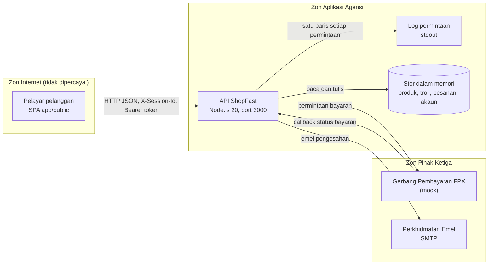

# Seni Bina Sistem (System Architecture): ShopFast

> Sistem fiktif untuk latihan SQA. Dokumen ini ialah input bagi Modul 3 (Semakan Reka Bentuk dan Perancangan Ujian Berasaskan Risiko).
> Rujukan KRISA: [KRISAv2 Bab 4, 4.5 Reka Bentuk Seni Bina Sistem](../../../references/krisa-v2-beta-2026/BAB4-FASA-REKA-BENTUK.pdf#page=4). Templat berkaitan: [D04 Spesifikasi Reka Bentuk Sistem (SDS)](../../../references/templates-D01-D18/docx/D04_DOKUMEN_SPESIFIKASI_REKABENTUK_SISTEM_SDS.docx).
> Dokumen berkaitan: [SRS-ShopFast.md](SRS-ShopFast.md), [openapi.yaml](openapi.yaml).

| Perkara | Butiran |
|---|---|
| No. Dokumen | PUD-SF-ARK-01 |
| Versi | 1.1 |
| Tarikh | 8 September 2026 |
| Disediakan oleh | Pasukan Pembangunan, Bahagian Transformasi Digital (fiktif) |

---

## 1. Gambaran Keseluruhan

ShopFast menggunakan seni bina tiga lapisan (3-tier):

1. **Lapisan Persembahan (Presentation tier):** Aplikasi web satu halaman (SPA) dalam HTML, CSS dan JavaScript tulen, dilayan sebagai fail statik daripada `app/public`.
2. **Lapisan Aplikasi (Application tier):** API ShopFast dalam Node.js 20 tanpa kebergantungan luaran (modul `node:http`, `node:crypto`). Semua logik troli, diskaun, checkout, kitar hayat pesanan dan log masuk berada di sini.
3. **Lapisan Data (Data tier):** Stor data dalam memori (in-memory store) menggunakan struktur `Map` bagi produk, troli, pesanan dan akaun. Data hilang apabila proses dimulakan semula.

Perkhidmatan luaran:
- **Gerbang Pembayaran FPX (mock):** mensimulasikan bayaran dan memanggil semula (callback) ShopFast dengan keputusan bayaran.
- **Perkhidmatan Emel:** menghantar emel pengesahan pesanan melalui SMTP agensi (dalam persekitaran latihan, emel ditulis ke log sahaja).

## 2. Rajah Seni Bina dan Sempadan Kepercayaan (Trust Boundaries)

| ID | Sempadan Kepercayaan | Keterangan | Kawalan Sedia Ada |
|---|---|---|---|
| TB1 kepada TB2 | Pelayar ke API | Semua input daripada pelayar dianggap tidak dipercayai | Pengesahan skema input pada setiap endpoint; CORS membenarkan semua origin |
| TB2 dalaman | API ke stor data dan log | Proses yang sama, tiada rangkaian | Tiada |
| TB2 kepada TB3 | API ke gerbang FPX dan emel | Trafik keluar ke pihak ketiga | HTTPS dalam produksi; mock dalam latihan |
| TB3 kepada TB2 | Callback FPX ke API | Keputusan bayaran masuk ke sistem | Dipanggil melalui endpoint peralihan status pesanan |

## 3. Keputusan Reka Bentuk Utama

| ID | Perkara | Keputusan Reka Bentuk |
|---|---|---|
| RB-01 | Sesi troli | Troli dikenal pasti oleh pengepala `X-Session-Id` yang dijana secara rawak oleh SPA dan disimpan dalam `localStorage`. |
| RB-02 | Log masuk dan token | `POST /api/auth/login` membandingkan hash kata laluan (SHA-256 dengan salt) dan memulangkan bearer token rawak yang sah selama 3600 saat. Token menentukan status keahlian bagi diskaun ahli. |
| RB-03 | Perlindungan log masuk | Kawalan cubaan log masuk bergantung kepada penguncian akaun: akaun dikunci selama 15 minit selepas 3 cubaan gagal berturut-turut. Had kadar permintaan (rate limiting) tidak dilaksanakan pada lapisan API kerana penguncian akaun sudah mengehadkan cubaan bagi setiap akaun. |
| RB-04 | Paparan pesanan | `GET /api/orders/{orderId}` memulangkan butiran pesanan berdasarkan ID pesanan sahaja. Endpoint ini tidak memerlukan token atau `X-Session-Id` supaya pautan dalam emel pengesahan boleh dibuka terus daripada mana-mana peranti. |
| RB-05 | Kitar hayat pesanan | `POST /api/orders/{orderId}/transitions` menerima tindakan pay, pack, ship, receive, fail atau cancel. Jadual peralihan yang dibenarkan disimpan sebagai konfigurasi dan peralihan lain ditolak dengan 409. Dalam persekitaran latihan, callback FPX dan tindakan Pegawai Pemenuhan disimulasikan melalui endpoint yang sama. |
| RB-06 | Log permintaan | Middleware log menulis satu baris JSON bagi setiap permintaan ke stdout: masa, kaedah, laluan, kod status, tempoh (ms) dan `X-Session-Id`. Bagi `POST /api/checkout`, medan `email` dan `phone` daripada badan permintaan turut direkodkan supaya khidmat pelanggan boleh menjejak pesanan pelanggan. |
| RB-07 | Pengiraan wang | Semua pengiraan wang dibuat dalam unit sen (integer) dan ditukar kepada RM dengan 2 tempat perpuluhan sebelum dipulangkan. |
| RB-08 | Ralat | Semua ralat dipulangkan sebagai JSON `{error, message}` dengan kod status HTTP yang sesuai. |
| RB-09 | Pemantauan | `GET /api/health` digunakan oleh alat pemantauan setiap minit. |

## 4. Aliran Data (Data Flows)

| ID | Aliran | Dari | Ke | Data | Klasifikasi Data |
|---|---|---|---|---|---|
| DF-01 | Semak katalog | Pelayar | API | Tiada data peribadi | Terbuka |
| DF-02 | Urus troli dan kod promosi | Pelayar | API | productId, quantity, code, X-Session-Id | Dalaman |
| DF-03 | Log masuk | Pelayar | API | email, password | Sulit |
| DF-04 | Checkout | Pelayar | API | fullName, email, phone, postcode, paymentMethod, cardExpiry | Data peribadi (Akta 709) |
| DF-05 | Simpan pesanan | API | Stor memori | Pesanan lengkap | Data peribadi (Akta 709) |
| DF-06 | Permintaan bayaran | API | Gerbang FPX | orderId, total | Sulit |
| DF-07 | Callback bayaran | Gerbang FPX | API | orderId, action (pay atau fail) | Sulit |
| DF-08 | Emel pengesahan | API | Perkhidmatan Emel | email, orderId, total | Data peribadi (Akta 709) |
| DF-09 | Log permintaan | API | stdout | Rujuk RB-06 | Dalaman |
| DF-10 | Paparan pesanan | API | Pelayar | Pesanan lengkap | Data peribadi (Akta 709) |

## 5. Senarai Endpoint

| Kaedah | Laluan | Fungsi | Keperluan | Pengesahan Diperlukan |
|---|---|---|---|---|
| GET | `/api/health` | Semakan kesihatan | FR-11 | Tiada |
| GET | `/api/products` | Senarai produk | FR-01 | Tiada |
| GET | `/api/cart` | Troli semasa dengan jumlah dikira | REQ-CHK-03, FR-03, FR-04 | `X-Session-Id`; Bearer token pilihan (diskaun ahli) |
| POST | `/api/cart/items` | Tambah item | REQ-CHK-01 | `X-Session-Id` |
| DELETE | `/api/cart/items/{productId}` | Buang item | FR-02 | `X-Session-Id` |
| POST | `/api/discounts/apply` | Guna kod promosi | REQ-CHK-02, REQ-CHK-03 | `X-Session-Id` |
| POST | `/api/checkout` | Buat pesanan | REQ-CHK-04, FR-05, FR-06 | `X-Session-Id`; Bearer token pilihan |
| POST | `/api/auth/login` | Log masuk | FR-09, FR-10 | Tiada |
| GET | `/api/orders/{orderId}` | Papar pesanan | FR-08 | Tiada (rujuk RB-04) |
| POST | `/api/orders/{orderId}/transitions` | Kemas kini status pesanan | REQ-CHK-05 | `X-Session-Id` |

Kontrak penuh setiap endpoint: [openapi.yaml](openapi.yaml).

## 6. Persekitaran

| Persekitaran | Tujuan | Catatan |
|---|---|---|
| Pembangunan (Dev) | Komputer pembangun dan PC makmal | `npm start` pada http://localhost:3000 |
| CI | GitHub Actions `shopfast-quality-gate` | Ujian API (Newman) dan ujian UI (Playwright) bagi setiap push |
| Staging | Ujian penerimaan (UAT) dan ujian beban | Dirancang, tidak disediakan dalam latihan |
| Produksi | Operasi sebenar | Di luar skop latihan |
